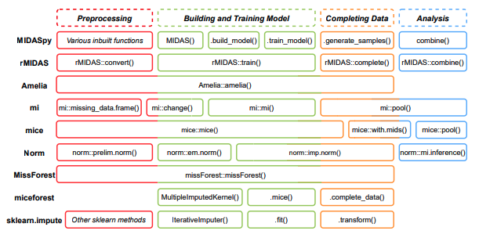

# Imputation
As Donald B. Rubin Said 'Imputing one value for a missing datum cannot be correct in general, because we don’t know what value to impute with certainty (if we did, it wouldn’t be missing).'
Multiple Imputation, developed by Donald B. Rubin in the 1970s, emerged as a solution to practical problems with missing income data. Fritz Scheuren's work on a joint project with the Social Security Administration and the U.S. Census Bureau highlighted issues with hot deck imputation, leading to Rubin's idea of using multiple versions of the complete dataset.

Rubin's key insight was that single imputation for missing values could not be generally correct. He proposed creating multiple imputations to capture the uncertainty of missing data, a revolutionary departure from previous methods. The 1977 report outlined how to choose models and derive imputations, emphasizing the Bayesian framework for inference.

Rubin's original proposal focused on studying variation due to uncertainty in imputed values. Though met with skepticism, the methodological and statistical foundation was laid by Rubin in 1987, introducing Rubin's rules for combining repeated complete-data estimates. The report provided essential formulas and conditions for valid statistical inference under multiple imputation.

Tests for parameter combinations and technical improvements for degrees of freedom followed in the 1990s. Multiple imputation faced criticism in this period, with concerns about validity depending on subsequent analysis and bias in estimating variance. The tide turned around 2005, with multiple imputation becoming widely accepted and implemented in major statistical packages.

Today, multiple imputation is the benchmark against which newer methods are compared, marking a significant evolution and acceptance in dealing with missing data.[Stef van Buuren, *Flexible Imputation of Missing Data*](https://stefvanbuuren.name/fimd/)

Image source: [Ranjit Lall, Thomas Robinson, Efficient Multiple Imputation for Diverse Data in Python and R: MIDASpy and rMIDAS, 2023](https://www.jstatsoft.org/article/view/v107i09)

The analysis of multiple imputation has been well-established for R and SPSS. However, Python users do not have direct access to the same functionality. In an effort to bridge this gap, I have attempted to develop Rubin's rules and analysis for multiple imputation as the benchmark for imputations in Python. As a result, we can assess our imputation.
# Function Documentation

| Function Name                           | Description                               |
|-----------------------------------------|-------------------------------------------|
| `encode_categorical`                    | Encoding categorical variables     |
| `numerical_backto_categorical`          | Return numerical to categorical              |
| `no_impute_variables`                          | Identify columns that may not be suitable for imputation ('Identifier', 'Datetime', 'High Cardinality', and 'Free Text'.|
| `numerical_rubin`          | Perform Rubin's Rules for combining results from multiple imputed datasets for numerical variables.              |
| `categorical_pooling`                          | Perform Rubin's Rules for combining results from multiple imputed datasets for categorical variables. |
| `evaluate_imputed_data`                          |  Evaluate imputed data and calculate various metrics.|

# The pooled sampling variance or D1 method for categorical variables

The multivariate Wald statistic is calculated as (Enders, 2010; Marshall et al., 2009):

$$D_1 = (\bar{\theta} - \theta_0) V_T^{-1} (\bar{\theta} - \theta_0) / k$$

where $\( \bar{\theta} \)$ and $\( \theta_0 \)$ are the pooled coefficient and the value under the null hypothesis (mostly zero), $\( V_T \)$ is the total variance, and $\( k \)$ is the number of parameters. $\( V_T \)$ is:
$$V_T = (1 + r_1) V_W$$
$\( r_1 \)$ is the relative increase in variance due to nonresponse (fraction of missing information), which is in this case obtained by:

$$\bar{r}_1 = (1 + 1/m) \cdot \text{tr}(V_B \bar{V}_W^{-1}) / k$$

where $\( V_B \)$ is the between-imputation variance, $\( V_W \)$ the within-imputation variance, and $\( m \)$ is the number of imputed datasets.
The p-value of the $\( D_1 \)$ statistic is calculated by comparing the value to an $F$ distribution with $\( k \)$ and $\( v_1 \)$ degrees of freedom.
$$p = \Pr[F_{k, v_1} > D_1] $$
Equation below is used when $t = k(m-1) > 4$, 
$$v_1 =  4 + (t - 4) [1 + (1 - 2 t^{-1}) r_1^{-1}]^2$$
otherwise, use the equation:
$$v_1= t (1 + k^{-1}) (1 + r_1^{-1})^2 / 2$$

[MW Heymans, Iris Eekhout, *Applied Missing Data Analysis with SPSS and R*](https://bookdown.org/mwheymans/bookmi/pooling-methods-for-categorical-variables.html)

# Rubin Rule for numerical variables
##### Pooling Effect Estimates
When Rubin's Rules (RR) are used, the assumption is that repeated parameter estimates are normally distributed. For certain statistics like correlation coefficients, transformations are applied before applying RR.
$$\bar{\theta} = \frac{1}{m} \left( \sum_{i=1}^{m} \theta_i \right)$$
Here, $\bar{\theta}$ is the pooled parameter estimate, $m$ is the number of imputed datasets, and $\theta_i$ is the parameter estimate in each imputed dataset $i$.

##### Pooling Standard Errors
The pooled standard error is derived from components reflecting within and between sampling variance.
$$V_W = \frac{1}{m} \sum_{i=1}^{m} SE_i^2$$

$$V_B =\frac{1}{m-1} \sum_{i=1}^{m} (\theta_i - \bar{\theta})^2$$

$$V_{Total} = V_W + V_B + \frac{V_B}{m}$$

$$SE_{Pooled} = \sqrt{V_{Total}}$$

##### Significance Testing
For significance testing, the univariate Wald test is used.
$$Wald_{Pooled} = \frac{(\bar{\theta} - \theta_0)^2}{V_{Total}}$$

##### Degrees of Freedom and P-values
Derivation of degrees of freedom (df) and p-value for the pooled t-test involve different formulas.
$$t_{df, 1-\alpha/2}$$
Degrees of Freedom for t-distribution (older method):
$$df_{Old} = (m-1) \lambda^{-2}$$
where 
$${\lambda} = \frac{V_B + \frac{V_B}{m}}{V_{\text{Total}}}$$

##### Confidence Intervals
For the 95% confidence interval:
$$\bar{\theta} \pm t_{df, 1-\alpha/2} \times SE_{Pooled}$$
Here, $\bar{\theta}$ is the pooled estimate, $t$ is the t-statistic, $df$ is degrees of freedom, and $SE_{pooled}$ is the pooled standard error.

[MW Heymans, Iris Eekhout, *Applied Missing Data Analysis with SPSS and R*](https://bookdown.org/mwheymans/bookmi/rubins-rules.html)

# Evaluation Metrics Formulas

##### Raw Bias:
$$\text{Raw Bias} = \frac{1}{n} \sum_{i=1}^{n} (\text{Imputed}_i - \text{True}_i)$$

##### Coverage Rate:
$$\text{Coverage Rate} = \frac{1}{n} \sum_{i=1}^{n} I(\text{True}_i \geq \text{Lower Bound}_i) \  \text{and} \  I(\text{True}_i \leq \text{Upper Bound}_i)$$
where $I(\cdot)$ is the indicator function.

##### Average Width:
$$\text{Average Width} = \frac{1}{n} \sum_{i=1}^{n} (\text{Upper Bound}_i - \text{Lower Bound}_i)$$

##### Root Mean Squared Error (RMSE):
$$\text{RMSE} = \sqrt{\frac{1}{n} \sum_{i=1}^{n} (\text{Imputed}_i - \text{True}_i)^2}$$

##### Accuracy:
$$\text{Accuracy} = \frac{1}{n} \sum_{i=1}^{n} I(\text{Round}(\text{Imputed}_i) = \text{True}_i)$$

where $\text{Round}(\cdot)$ rounds the values to the nearest integer.

##### Mean Squared Error (MSE):
$$\text{MSE} = \frac{1}{n} \sum_{i=1}^{n} (\text{Imputed}_i - \text{True}_i)^2$$

##### R-squared:
$$R^2 = 1 - \frac{\text{MSE}}{\text{Var(True)}}$$

where $\text{Var(True)}$ is the variance of the true labels.

Note: The formulas assume $n$ is the number of samples in the dataset.
